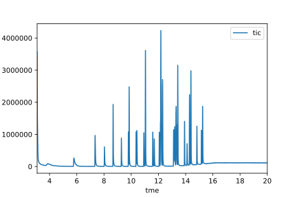

<!--  -->


---

## Overview

Pyvalence is a library for processing data generated from analytical chemistry. Pyvalence aims to reduce data analysis time so reachers can spend more time interpreting results. By providing a python library for reading in analytical data from the native formats and organizatng it into readily accessible pandas dataframes analysis can be moved away from the benchside and accelerated. Pyvalence supports common analysis techniques (e.g. standard curves regression and utilization) to reduce manual, one-off data processing.

### Features

Pyvalence easily import data from a root directory using `valence.build`

```
agi = AgilentGcms.from_root('data-directory')
```

which provides easily acccessible and organized data.

```
library_ids   = agi.results_lib
areas         = agi.results_tic
chromatograms = agi.chromatogram
```
Plotting the chromatogram is now simple with matplotlib

```
chromatgrams.loc['run1'].plot('tme','tic')
```
<p align="center">
  
</p>
For GCMS data `valence.analysis` will compile, create regression curves and calculate concentrations few lines of code. 

```
compiled_data = match_area(lib,area)
curves        = std_curves(comp,stnd)
conc          = concentrations(compiled_data,curves)
```


## Installation

### conda

`valence` depends on scientific python packages that can be tricky to build from source.  For that reason, we recommend the [Anaconda python distribution](https://www.continuum.io/downloads) which utilizes the `conda` package management system.

With `conda`, binary installers for the planning version of `valence` are accessible via:

``` bash
conda install -c blakeboswell valence=0.0.2
```

### PyPi

> Forthcoming

### Installing from Source

> Forthcoming

## Dependencies

- [`Python`](https://www.python.org) >= 3.6

The following dependencies are bundled in the `valence` install:

- [`pandas`](http://pandas.pydata.org) >= 0.20.2
- [`numpy`](https://www.scipy.org) >= 1.13.1
- [`scipy`](http://www.numpy.org)  >= 0.19.1

## Documentation

The process flow pyvalence is to first readin the data using 

### Examples

Tour the _on-rails_ example notebooks at [`valence` on-rails](https://github.com/blakeboswell/valence-on-rails).

## License

[BSD 3-clause](https://github.com/blakeboswell/valence/blob/master/LICENSE)


